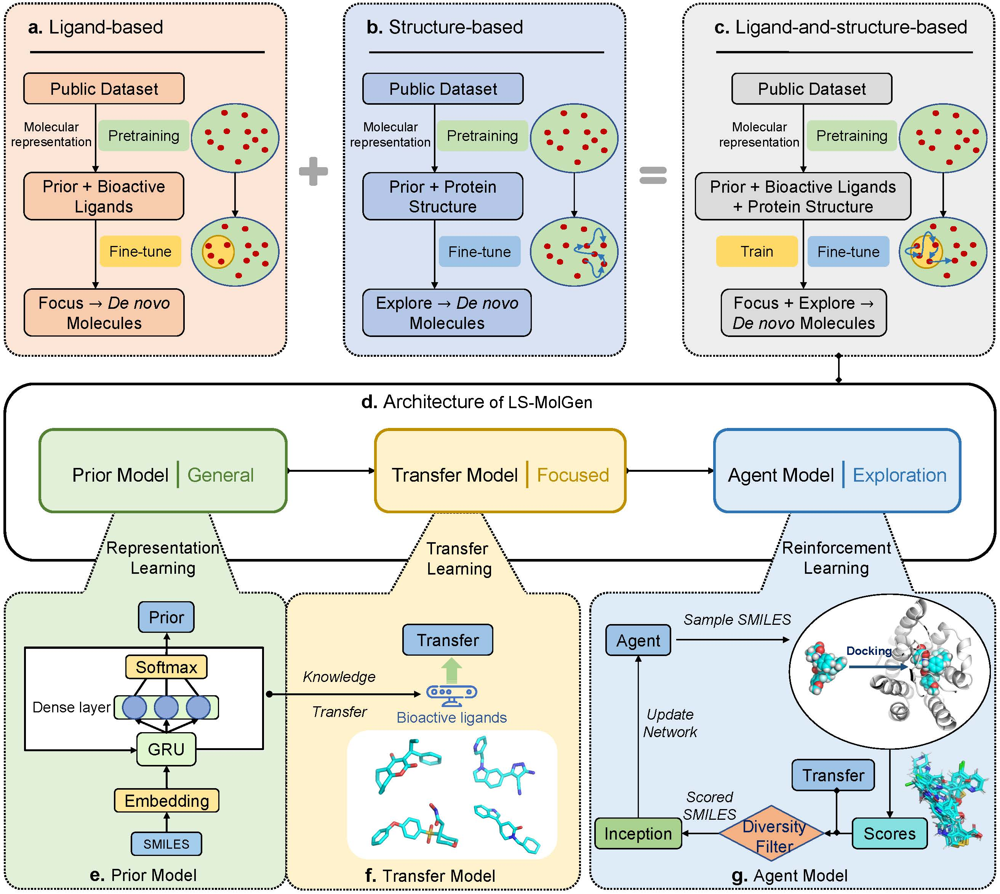

# LS-MolGen
A ligand-and-structure dual-driven deep reinforcement learning method for target-specific molecular generation.



Paper: [https://pubs.acs.org/doi/10.1021/acs.jcim.3c00587](https://pubs.acs.org/doi/10.1021/acs.jcim.3c00587)

# Installation
You can use the environment.yml file to create a new conda environment with all the necessary dependencies for LS-MolGen:

```
git clone https://github.com/songleee/LS-MolGen.git
cd LS-MolGen
conda env create -f environment.yml
conda activate LS-MolGen
```

# Dependences
To run this code, especially the reinforcement learning part, the following softwares are required:

1. `LeDock`: the program used to get the docking score. Download from [here](http://www.lephar.com/download.htm).

2. `Open Babel`: the software used to prepare the ligand. Download from [here](https://github.com/openbabel/openbabel/releases).

After download the release packages of them, remember to add the PATH of them to the environment variables.

# Usage
LS-MolGen includes three sub-modules:

1. `pre_train.py`: Used for pre-training on big dataset.

2. `transfer_learning.py`: Used for fine-tuning the pre-trained neural network on a small dataset of molecules with known bioactivity.

3. `reinforcement_learning.py`: Used for generating new molecules with high affinity and novelty using the reinforcement learning algorithm.

Example of running the command:
```
python pre_train.py

python transfer_learning.py

python reinforcement_learning.py
```

# Credits
LS-MolGen was developed by Song Li as part of a research project at Shanghai Jiao Tong University.

# License
LS-MolGen is released under the Apache License. See the LICENSE file for details.


songlee@sjtu.edu.cn
